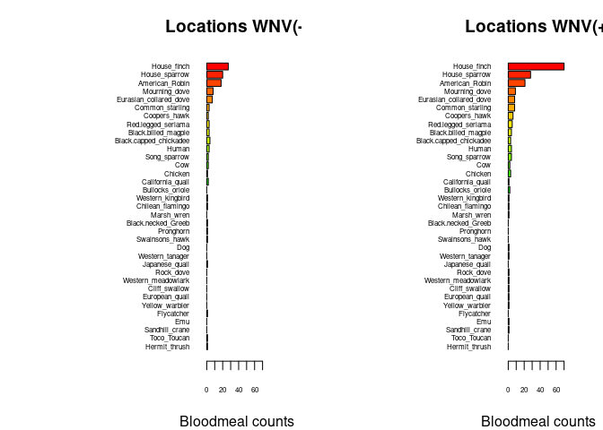

Warm-up mini-Report: Mosquito Blood Hosts in Salt Lake City, Utah
================
Maddy Wilford
2025-10-27

- [ABSTRACT](#abstract)
- [BACKGROUND](#background)
- [STUDY QUESTION and HYPOTHESIS](#study-question-and-hypothesis)
  - [Question](#question)
  - [Hypothesis](#hypothesis)
  - [Prediction](#prediction)
- [METHODS](#methods)
- [DISCUSSION](#discussion)
- [CONCLUSION](#conclusion)
- [REFERENCES](#references)

# ABSTRACT

West Nile Virus (WNV) is a mosquito-borne disease that relies on avian
hosts to maintain and amplify its transmission cycle. This study aimed
to identify which bird species act as the primary amplifying hosts of
WNV in Salt Lake City, Utah. Sixty mosquitoes were collected from both
WNV-positive and WNV-negative sites, and their blood meals were analyzed
to determine the animal DNA present. DNA extraction was followed by PCR
amplification, gel electrophoresis, and sequencing with MinION, after
which BLASTn analysis was used to identify host species. A generalized
linear model (GLM) was conducted to test whether the presence and number
of house finch blood meals could predict WNV positivity at collection
sites. Results showed that house finches accounted for the highest
number of mosquito blood meals in both positive and negative WNV
locations, with significantly higher counts in positive sites. The GLM
produced a low p-value (~0.00), indicating a strong positive correlation
between house finch blood meal counts and WNV presence. These findings
support the hypothesis that house finches serve as key amplifying hosts
for WNV in Salt Lake City due to their high viremia duration and
prevalence in mosquito blood meals.

# BACKGROUND

West Nile Virus (WNV) is a mosquito-born flavivirus and human, equine,
and avian neuropathogen (Campbell et at.). Birds serve as the natural
reservoir hosts, maintaining the WNV in nature though a
mosquito-bird-mosquito cycle, primarily involving Culex mosquitos
(Campbell et al.). Since WNV is prevalent in the US, scientists are
studying these transmission cycles in order to figure out what hosts are
amplifying the transfer. This knowledge helps mosquito abatement
programs, like the one in Salt Lake City, target their efforts more
effectively by spraying and tracking mosquito populations that
contribute most to WNV transmissions. The figure below illustrates how
long the viremia virus persists in different bird species. Based on the
data, house finches and great horned owls maintain viremia for the
longest durations. Since house finches are more common in SLC, they are
a likely candidate for amplifying WNV to the area. To test this
hypothesis, we will extract mosquito DNA using PCR and gel
electrophoresis, followed by sequencing with a MinION device. The
results will be analyzed by using BLASTn to identify the animal DNA
present in the mosquito blood meals. By comparing these results, we can
determine whether or not more house finch blood meals equates with and
increase in WNV rates.

``` r
# Manually transcribe duration (mean, lo, hi) from the last table column
duration <- data.frame(
  Bird = c("Canada Goose","Mallard", 
           "American Kestrel","Northern Bobwhite",
           "Japanese Quail","Ring-necked Pheasant",
           "American Coot","Killdeer",
           "Ring-billed Gull","Mourning Dove",
           "Rock Dove","Monk Parakeet",
           "Budgerigar","Great Horned Owl",
           "Northern Flicker","Blue Jay",
           "Black-billed Magpie","American Crow",
           "Fish Crow","American Robin",
           "European Starling","Red-winged Blackbird",
           "Common Grackle","House Finch","House Sparrow"),
  mean = c(4.0,4.0,4.5,4.0,1.3,3.7,4.0,4.5,5.5,3.7,3.2,2.7,1.7,6.0,4.0,
           4.0,5.0,3.8,5.0,4.5,3.2,3.0,3.3,6.0,4.5),
  lo   = c(3,4,4,3,0,3,4,4,4,3,3,1,0,6,3,
           3,5,3,4,4,3,3,3,5,2),
  hi   = c(5,4,5,5,4,4,4,5,7,4,4,4,4,6,5,
           5,5,5,7,5,4,3,4,7,6)
)

# Choose some colors
cols <- c(rainbow(30)[c(10:29,1:5)])  # rainbow colors

# horizontal barplot
par(mar=c(5,12,2,2))  # wider left margin for names
bp <- barplot(duration$mean, horiz=TRUE, names.arg=duration$Bird,
              las=1, col=cols, xlab="Days of detectable viremia", xlim=c(0,7))

# add error bars
arrows(duration$lo, bp, duration$hi, bp,
       angle=90, code=3, length=0.05, col="black", xpd=TRUE)
```


# STUDY QUESTION and HYPOTHESIS

## Question

Which aviary host is amplifying the transfer of WNV to mosquitoes in
Salt Lake City?

## Hypothesis

If house finches carry viremia the longest in their system, then they
most likely will be the top host that is amplifying the transfer of WNV.

## Prediction

If house finches are transferring WNV the most, then we suspect that
they will be the top aviary species caught in the traps located in
positive WNV locations

# METHODS

In this study, we aimed to find out what kind of animal DNA was in the
blood meals of mosquitoes from Salt Lake City (SLC). We took a sample of
sixty mosquitoes and crushed them up in order to run a PCR to copy the
DNA. Once we ran the PCR, a gel electrophoresis was performed. Once we
did that, we ran a MinION sequence and BLASTn analysis to analyze the
DNA from the PCR and gel.

The horizontal bar plot below shows us what kind of aviary species were
found in the mosquito blood meals and how many of those birds there
were. The bar plot not only tells us the positive location sites (on the
right) but also compares the birds found in negative WNV locations (on
the left). This visualization helps us to see what birds are amplifying
WNV and how many of those birds ended up being caught in positive WNV
locations.

``` r
## import counts_matrix: data.frame with column 'loc_positives' (0/1) and host columns 'host_*'
counts_matrix <- read.csv("./bloodmeal_plusWNV_for_BIOL3070.csv")

## 1) Identify host columns
host_cols <- grep("^host_", names(counts_matrix), value = TRUE)

if (length(host_cols) == 0) {
  stop("No columns matching '^host_' were found in counts_matrix.")
}

## 2) Ensure loc_positives is present and has both levels 0 and 1 where possible
counts_matrix$loc_positives <- factor(counts_matrix$loc_positives, levels = c(0, 1))

## 3) Aggregate host counts by loc_positives
agg <- stats::aggregate(
  counts_matrix[, host_cols, drop = FALSE],
  by = list(loc_positives = counts_matrix$loc_positives),
  FUN = function(x) sum(as.numeric(x), na.rm = TRUE)
)

## make sure both rows exist; if one is missing, add a zero row
need_levels <- setdiff(levels(counts_matrix$loc_positives), as.character(agg$loc_positives))
if (length(need_levels)) {
  zero_row <- as.list(rep(0, length(host_cols)))
  names(zero_row) <- host_cols
  for (lv in need_levels) {
    agg <- rbind(agg, c(lv, zero_row))
  }
  ## restore proper type
  agg$loc_positives <- factor(agg$loc_positives, levels = c("0","1"))
  ## coerce numeric host cols (they may have become character after rbind)
  for (hc in host_cols) agg[[hc]] <- as.numeric(agg[[hc]])
  agg <- agg[order(agg$loc_positives), , drop = FALSE]
}

## 4) Decide species order (overall abundance, descending)
overall <- colSums(agg[, host_cols, drop = FALSE], na.rm = TRUE)
host_order <- names(sort(overall, decreasing = TRUE))
species_labels <- rev(sub("^host_", "", host_order))  # nicer labels

## 5) Build count vectors for each panel in the SAME order
counts0 <- rev(as.numeric(agg[agg$loc_positives == 0, host_order, drop = TRUE]))
counts1 <- rev(as.numeric(agg[agg$loc_positives == 1, host_order, drop = TRUE]))

## 6) Colors: reuse your existing 'cols' if it exists and is long enough; otherwise generate
if (exists("cols") && length(cols) >= length(host_order)) {
  species_colors <- setNames(cols[seq_along(host_order)], species_labels)
} else {
  species_colors <- setNames(rainbow(length(host_order) + 10)[seq_along(host_order)], species_labels)
}

## 7) Shared x-limit for comparability
xmax <- max(c(counts0, counts1), na.rm = TRUE)
xmax <- if (is.finite(xmax)) xmax else 1
xlim_use <- c(0, xmax * 1.08)

## 8) Plot: two horizontal barplots with identical order and colors
op <- par(mfrow = c(1, 2),
          mar = c(4, 12, 3, 2),  # big left margin for species names
          xaxs = "i")           # a bit tighter axis padding

## Panel A: No WNV detected (loc_positives = 0)
barplot(height = counts0,
        names.arg = species_labels, 
        cex.names = .5,
        cex.axis = .5,
        col = rev(unname(species_colors[species_labels])),
        horiz = TRUE,
        las = 1,
        xlab = "Bloodmeal counts",
        main = "Locations WNV(-)",
        xlim = xlim_use)

## Panel B: WNV detected (loc_positives = 1)
barplot(height = counts1,
        names.arg = species_labels, 
        cex.names = .5,
        cex.axis = .5,
        col = rev(unname(species_colors[species_labels])),
        horiz = TRUE,
        las = 1,
        xlab = "Bloodmeal counts",
        main = "Locations WNV(+)",
        xlim = xlim_use)
```

<!-- -->

``` r
par(op)

## Keep the colors mapping for reuse elsewhere
host_species_colors <- species_colors
```

A generalized linear model(GLM) was performed to test whether the
presence or number of house finch blood meals can predict whether a site
had WNV-positive pools (binary) or a higher WNV positivity rate
(numeric). This GLM test allows us to formally evaluate the relationship
suggested by the bar plot above.

``` r
# second-analysis-or-plot, glm with house finch alone against binary +/_
glm1 <- glm(loc_positives ~ host_House_finch,
            data = counts_matrix,
            family = binomial)
summary(glm1)
```

    ## 
    ## Call:
    ## glm(formula = loc_positives ~ host_House_finch, family = binomial, 
    ##     data = counts_matrix)
    ## 
    ## Coefficients:
    ##                  Estimate Std. Error z value Pr(>|z|)  
    ## (Intercept)       -0.1709     0.1053  -1.622   0.1047  
    ## host_House_finch   0.3468     0.1586   2.187   0.0287 *
    ## ---
    ## Signif. codes:  0 '***' 0.001 '**' 0.01 '*' 0.05 '.' 0.1 ' ' 1
    ## 
    ## (Dispersion parameter for binomial family taken to be 1)
    ## 
    ##     Null deviance: 546.67  on 394  degrees of freedom
    ## Residual deviance: 539.69  on 393  degrees of freedom
    ## AIC: 543.69
    ## 
    ## Number of Fisher Scoring iterations: 4

``` r
#glm with house-finch alone against positivity rate
glm2 <- glm(loc_rate ~ host_House_finch,
            data = counts_matrix)
summary(glm2)
```

    ## 
    ## Call:
    ## glm(formula = loc_rate ~ host_House_finch, data = counts_matrix)
    ## 
    ## Coefficients:
    ##                  Estimate Std. Error t value Pr(>|t|)    
    ## (Intercept)      0.054861   0.006755   8.122 6.07e-15 ***
    ## host_House_finch 0.027479   0.006662   4.125 4.54e-05 ***
    ## ---
    ## Signif. codes:  0 '***' 0.001 '**' 0.01 '*' 0.05 '.' 0.1 ' ' 1
    ## 
    ## (Dispersion parameter for gaussian family taken to be 0.01689032)
    ## 
    ##     Null deviance: 6.8915  on 392  degrees of freedom
    ## Residual deviance: 6.6041  on 391  degrees of freedom
    ##   (2 observations deleted due to missingness)
    ## AIC: -484.56
    ## 
    ## Number of Fisher Scoring iterations: 2

# DISCUSSION

Our goal was to see if house finches were the top aviary species
amplifying the transfer of WNV. Based on our bar plot, we were able to
see that house fiches had the most blood meal counts in both the
negative and positive WNV locations. The house finch blood meal counts
were also higher in the positive locations, indicating that they are
having an influence in amplifying the transfer of WNV. We can see as
well that with other birds, they had about the same blood meal counts in
both the positive and negative location sites, compared to the house
finch, which had a significantly higher blood meal count in the positive
WNV locations compared to the negative locations.

We wanted to run a formal analysis though to prove statistically that
there was significant evidence to say that house finch blood meals were
correlating to the increased rate of WNV. The GLM compares our response
variable (the rate of WNV) and the predictor variable (house finch blood
meal counts). The binary analysis was able to give us a p-value, which
tells us if the data is significant or not. Since we got a low p-value
of about zero, that tells us that the correlation was significant enough
to suggest that there is a positive correlation between house finch
blood meal counts and the rate of WNV. Indicating that if house finch
blood meal counts increase, so does the rate of WNV cases.

From both of our analyses we performed, we are able to say that they
support are hypothesis that since house finches carry viremia the
longest, that they are significantly influencing the amplification of
WNV.

A limitation that we had is that we were limited to a sample of
mosquitoes that came from the Salt Lake district. So we can only say
that house finches are amplifying WNV in Salt Lake City and not the rest
of Utah. We also don’t know if there could be another species that is
aiding in amplification if they weren’t caught in the specific traps
that were set up.

# CONCLUSION

Based on our data analyses, bar plot, and glm, our findings show that
house finches do play an important role in amplifying the transfer of
WNV in SLC. The combination of the bar plot and GLM confirmed that
mosquitoes feeding on house finches were more frequently associated with
WNV-positive sites. The positive correlation between house finch blood
meal counts and WNV rates supports the idea that house finches are
acting as a major reservoir; maintaining and enhancing vial transmission
cycles. These results allow us to understand which birds are helping to
spread WNV and help programs like the mosquito abatement district
control and prevent diseases like WNV. Focusing efforts on areas where
house finches and mosquitoes interact the most could reduce the risk and
WNV transmission and better protect public health.

# REFERENCES

1.  Komar N, Langevin S, Hinten S, Nemeth N, Edwards E, Hettler D, Davis
    B, Bowen R, Bunning M. Experimental infection of North American
    birds with the New York 1999 strain of West Nile virus. Emerg Infect
    Dis. 2003 Mar;9(3):311-22. <https://doi.org/10.3201/eid0903.020628>

2.  ChatGPT. OpenAI, version Jan 2025. Used as a reference for functions
    such as plot() and to correct syntax errors. Accessed 2025-10-27.

3.  Campbell, G. L., Marfin, A. A., Lanciotti, R. S., & Gubler, D. J.
    (2002). West Nile virus. The Lancet Infectious Diseases, 2(9),
    519–529. <https://doi.org/10.1016/s1473-3099(02)00368-7>
